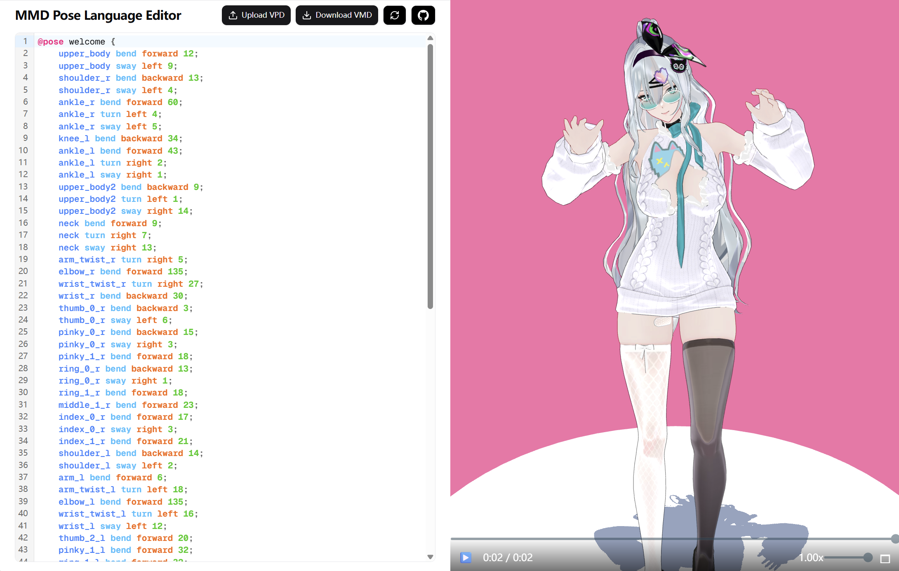

# MPL - Motion Programming Language

MPL is a domain-specific language that revolutionizes 3D motion and animation through human-readable, semantic syntax. Designed to bridge the gap between natural language and 3D movement, MPL transforms complex mathematical representations into intuitive, code-like commands that both humans and AI systems can easily understand and generate.

**Current Implementation:** MMD (MikuMikuDance) format support with plans for broader 3D animation ecosystems.



[Gallery](https://popo.love/gallery) and [playground](https://popo.love/playground)

[npm](https://www.npmjs.com/package/mmd-mpl)

[crates](https://crates.io/crates/mmd-mpl)

## Why MPL?

### 🎯 **Human-Centric Design**

- **Semantic commands**: Intuitive, readable syntax for complex 3D movements
- **Natural language alignment**: Bridge human intent and 3D mathematics
- **Built-in safety**: Anatomically-aware constraints prevent impossible poses

### 🤖 **AI & Machine Learning Ready**

- **LLM-friendly syntax**: Structured grammar for language models
- **Training-optimized**: Semantic tokens for AI motion synthesis
- **Compositional intelligence**: Modular components for pattern learning
- **Cross-modal potential**: Text-to-motion and motion-to-text transformations

### 🔧 **Developer Benefits**

- **Composable architecture**: Reusable animation building blocks
- **Version control friendly**: Text-based format for development workflows
- **Extensible framework**: Domain-agnostic design for future formats

## Syntax

### Pose Definitions

```
@pose kick_left {
    leg_l bend forward 30;
    knee_l bend backward 0;
    leg_r bend backward 20;
    knee_r bend backward 15;
}

@pose kick_right {
    leg_r bend forward 30;
    knee_r bend backward 0;
    leg_l bend backward 20;
    knee_l bend backward 15;
}
```

### Animation Sequences

```
@animation walk {
    0: kick_left;
    0.3: kick_right;
    0.6: kick_left;
    0.9: kick_right;
}
```

### Main Execution

```
main {
    walk;
}
```

## Bone Commands

**Format:** `bone action direction amount;` or `bone reset;`

**Actions:** `bend`, `turn`, `sway`, `move`, `reset`  
**Directions:** `forward`, `backward`, `left`, `right`, `up`, `down`

### Compound Statements

Multiple actions for the same bone can be combined on a single line using commas:

```
head turn left 30, bend forward 20, sway right 15;
arm raise up 45, rotate right 15;
neck reset;
```

## Supported Bones

**Body Core:** `base`, `center`, `upper_body`, `waist`, `neck`, `head`  
**Arms:** `shoulder_l/r`, `arm_l/r`, `arm_twist_l/r`, `elbow_l/r`, `wrist_l/r`, `wrist_twist_l/r`  
**Legs:** `leg_l/r`, `knee_l/r`, `ankle_l/r`, `toe_l/r`  
**Fingers:**

- **Individual joints:** `thumb_0/1/2_l/r`, `index_0/1/2_l/r`, `middle_0/1/2_l/r`, `ring_0/1/2_l/r`, `pinky_0/1/2_l/r`
- **Grouped shortcuts:** `thumb_l/r`, `index_l/r`, `middle_l/r`, `ring_l/r`, `pinky_l/r`

### Finger Control Shortcuts

Grouped finger shortcuts automatically expand to individual joint movements with realistic ratios:

```
// Using grouped shortcuts (recommended for most cases)
index_l bend forward 30;    // Expands to: index_0_l bend forward 30, index_1_l bend forward 27, index_2_l bend forward 20
middle_l bend forward 25;   // Expands to: middle_0_l bend forward 25, middle_1_l bend forward 23, middle_2_l bend forward 16
thumb_l bend forward 20;    // Expands to: thumb_0_l bend forward 20, thumb_1_l bend forward 17

// Using individual joints (for precise control)
index_0_l bend forward 30;
index_1_l bend forward 25;
index_2_l bend forward 15;
```

**Finger Bending Ratios:**

- **Index/Middle:** 100% → 90% → 65%
- **Ring:** 100% → 88% → 60%
- **Pinky:** 100% → 85% → 55%
- **Thumb:** 100% → 85%

Both approaches can be mixed in the same pose.

## 📄 License

GPL-3.0 License - see LICENSE for details.
