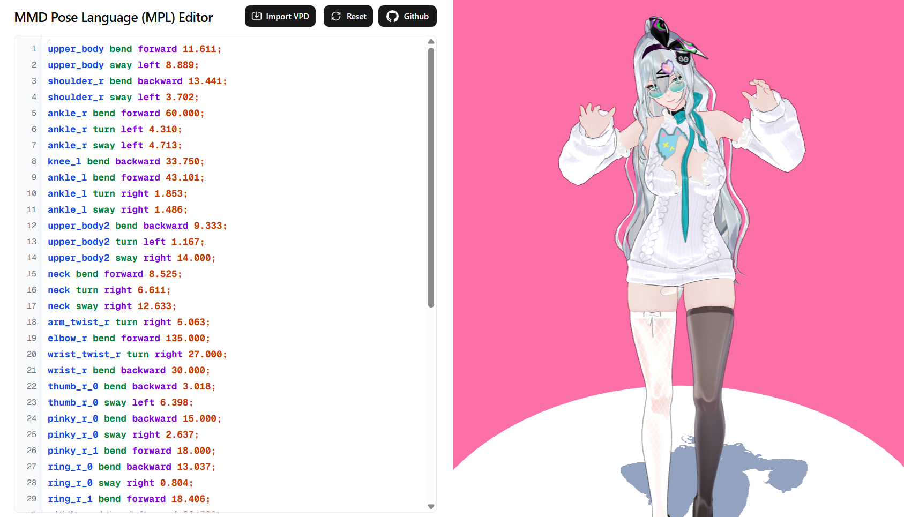

# MPL - MMD Pose Language

MPL is a rule-based Domain-Specific Language for controlling MMD bones and creating animations using natural language commands.



## Why MPL?

Instead of manually calculating quaternions and dealing with bone direction complexities, MPL provides intuitive pose descriptions and structured animation creation:

```
"look at the sky" → @pose look_up { head bend backward 60; neck bend backward 30; }
"wave hello" → @pose wave { arm_r bend forward 90; wrist_r bend forward 30; }
"point forward" → @pose point { arm_r bend forward 45; index_r_0 bend forward 90; }
```

## Latest Syntax

MPL supports structured pose definitions and animation sequences:

### Pose Definitions

Define reusable poses with the `@pose` decorator:

```
@pose kick_left {
    leg_l bend forward 30;
    knee_l bend backward 0;
    leg_r bend backward 20;
    knee_r bend backward 15;
}

@pose kick_right {
    leg_r bend forward 30;
    knee_r bend backward 0;
    leg_l bend backward 20;
    knee_l bend backward 15;
}
```

### Animation Sequences

Create timed animation sequences with the `@animation` decorator:

```
@animation walk {
    0: kick_left;
    0.3: kick_right;
    0.6: kick_left;
    0.9: kick_right;
}

@animation greeting {
    0: @pose { arm_r bend forward 45; };
    0.5: @pose { arm_r bend forward 90; wrist_r sway left 30; };
    1.0: @pose { arm_r bend forward 45; };
}
```

### Main Execution Block

Execute animations in the main block:

```
main {
    walk;
    greeting;
}
```

## Bone Command Format

**Format:** `bone action direction degrees`

**Actions:** `bend`, `turn`, `sway`  
**Directions:** `forward`, `backward`, `left`, `right`

### Single Statement Examples:

```
head turn left 30
arm_r bend forward 90
elbow_l bend forward 120
wrist_r sway left 45
thumb_0_r bend forward 60
```

### Multi-Statement Examples:

Within pose blocks, combine multiple statements with semicolons:

```
@pose complex_pose {
    head turn right 30; head bend backward 20;
    arm_l bend forward 60; arm_l sway left 30; shoulder_l bend forward 20;
    leg_l bend forward 45; leg_l sway left 25; ankle_l bend forward 15;
    head turn left 20; neck turn left 15; upper_body turn left 10;
}
```

## Multi-Statement Support

MPL supports multiple statements separated by semicolons (`;`), allowing complex pose creation:

- **Multiple bones**: `arm_l bend forward 45; arm_r bend forward 45; head turn left 15;`
- **Multiple actions on same bone**: `head turn right 30; head bend backward 20;`
- **Joint chains**: `head bend forward 25; neck bend forward 20; upper_body bend forward 15;`

## Built-in Safety

- **Anatomical constraints**: Prevents impossible poses (elbows can't bend backward)
- **Range limits**: Automatically clamps values to realistic human movement ranges
- **Action validation**: Only allows anatomically correct bone movements
- **Quaternion mathematics**: Properly combines multiple rotations on the same bone

## Supported Bones

**Body Core:**

- `base`, `center`, `upper_body`, `waist`, `neck`, `head`

**Arms:**

- `shoulder_l/r`, `arm_l/r`, `arm_twist_l/r`, `elbow_l/r`, `wrist_l/r`, `wrist_twist_l/r`

**Legs:**

- `leg_l/r`, `knee_l/r`, `ankle_l/r`, `toe_l/r`

**Fingers:**

- `thumb_0/1/2_l/r`, `index_0/1/2_l/r`, `middle_0/1/2_l/r`, `ring_0/1/2_l/r`, `pinky_0/1/2_l/r`

[Available actions and limits for each bone](./src/lib/mpl.ts#L78)

## 📄 License

GPL-3.0 License - see LICENSE for details.
